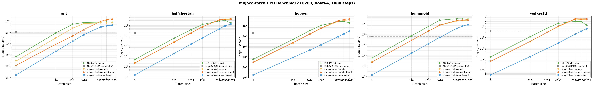

# mujoco-torch

A PyTorch port of [MuJoCo MJX](https://mujoco.readthedocs.io/en/stable/mjx.html),
bringing GPU-accelerated physics simulation to the PyTorch ecosystem with full
`torch.compile` and `torch.vmap` support.

## Features

- **Drop-in MJX replacement** -- same physics pipeline (forward dynamics,
  constraints, contacts, sensors) reimplemented in PyTorch.
- **`torch.vmap`** -- batch thousands of environments in a single call with
  automatic vectorisation.
- **`torch.compile`** -- fuse the entire step into optimised GPU kernels; no
  Python overhead at runtime.
- **Numerically equivalent to MJX** -- verified at float64 precision for every
  step (see `test/mjx_correctness_test.py`).

## Installation

```bash
pip install -e .
```

### Requirements

- Python >= 3.10
- PyTorch (see [PyTorch build](#pytorch-build) below for `torch.compile` support)
- MuJoCo >= 3.0
- tensordict >= 0.11

### PyTorch build

`torch.compile(fullgraph=True)` requires several upstream fixes that are not yet
in a released PyTorch version.  Until they land, build PyTorch from the
[`mujoco-torch-features`](https://github.com/vmoens/pytorch/tree/mujoco-torch-features)
branch:

```bash
git clone --branch mujoco-torch-features --depth 1 \
    https://github.com/vmoens/pytorch.git
cd pytorch
git submodule update --init --recursive --depth 1
pip install -e . --no-build-isolation   # takes ~30-60 min
```

You will also need a source build of
[tensordict](https://github.com/pytorch/tensordict):

```bash
pip install git+https://github.com/pytorch/tensordict.git
```

Without this custom PyTorch build, eager mode and `torch.vmap` work fine; only
`torch.compile(fullgraph=True)` requires the fork.

## Quick start

```python
import mujoco
import torch
import mujoco_torch

torch.set_default_dtype(torch.float64)

# Load a MuJoCo model
m_mj = mujoco.MjModel.from_xml_path("humanoid.xml")
mx = mujoco_torch.device_put(m_mj).to("cuda")

# Create initial data and move to GPU
d_mj = mujoco.MjData(m_mj)
dx = mujoco_torch.device_put(d_mj).to("cuda")

# Single step
dx = mujoco_torch.step(mx, dx)

# Batched simulation with vmap
batch_size = 4096
envs = [mujoco_torch.device_put(mujoco.MjData(m_mj)).to("cuda")
        for _ in range(batch_size)]
d_batch = torch.stack(envs)
vmap_step = torch.vmap(lambda d: mujoco_torch.step(mx, d))
d_batch = vmap_step(d_batch)

# Compiled + batched for maximum throughput
compiled_step = torch.compile(vmap_step, fullgraph=True)
d_batch = compiled_step(d_batch)
```

## Feature matrix

| Category | Supported | Not yet supported |
|----------|-----------|-------------------|
| **Integrators** | Euler, RK4, ImplicitFast | Implicit |
| **Solvers** | CG, Newton | PGS |
| **Geom types** | Plane, HField, Sphere, Capsule, Box, Mesh | Ellipsoid, Cylinder |
| **Contact dim** | 1 (frictionless), 3 (frictional), 4 (torsional), 6 (rolling) | — |
| **Friction cone** | Pyramidal, Elliptic | — |
| **Joint types** | Free, Ball, Slide, Hinge | *(all supported)* |
| **Equality constraints** | Connect, Weld, Joint | Tendon, Distance |
| **Actuator dynamics** | None, Integrator, Filter, FilterExact, Muscle | User |
| **Actuator gain** | Fixed, Affine, Muscle | User |
| **Actuator bias** | None, Affine, Muscle | User |
| **Sensors** | 30+ types (position, velocity, acceleration) | CamProjection, Touch, Contact, FrameLinVel/AngVel/LinAcc/AngAcc |
| **Collision pairs** | 12 functions covering all supported geom combinations | — |

## Known limitations

- **Ellipsoid / Cylinder geoms** — no collision functions for these geom types.
- **Tendon / Distance equality constraints** — not yet ported from MJX.
- **PGS solver** — only CG and Newton solvers are available.

## Benchmarks



Measured on a single NVIDIA H200 GPU, float64 precision, 1 000 simulation
steps per configuration.  Sequential baselines (MuJoCo C, mujoco-torch loop)
are measured at B=1 since they scale linearly.

### Humanoid

| Configuration | B=1 | B=128 | B=1 024 | B=4 096 |
|---|--:|--:|--:|--:|
| MuJoCo C (CPU, sequential) | 61,644 | *(linear)* | *(linear)* | *(linear)* |
| mujoco-torch vmap (eager) | 11 | 1,249 | 10,139 | 40,001 |
| **mujoco-torch compile** | **92** | **11,059** | **85,868** | **336,391** |
| MJX (JAX jit+vmap) | 59 | 8,584 | 66,937 | 239,678 |

### Ant

| Configuration | B=1 | B=128 | B=1 024 | B=4 096 |
|---|--:|--:|--:|--:|
| MuJoCo C (CPU, sequential) | 106,163 | *(linear)* | *(linear)* | *(linear)* |
| mujoco-torch vmap (eager) | 15 | 1,894 | 15,107 | 60,566 |
| **mujoco-torch compile** | **119** | **11,245** | **89,627** | **280,053** |
| MJX (JAX jit+vmap) | 100 | 12,069 | 69,308 | 238,268 |

**Methodology.**  Each configuration runs 1 000 steps after warmup (5 compile
iterations for compiled variants, 1 JIT warmup for MJX).  Wall-clock time is
measured with `torch.cuda.synchronize()` / `jax.block_until_ready()` bracketing.
Steps/s = `batch_size × nsteps / elapsed_time`.  Single GPU
(`CUDA_VISIBLE_DEVICES=0`), dtype=float64.

To reproduce, run the benchmark script (requires the PyTorch fork above):

```bash
CUDA_VISIBLE_DEVICES=0 python -u gpu_bench.py --model humanoid
CUDA_VISIBLE_DEVICES=0 python -u gpu_bench.py --model ant
python scratch/plot_bench.py bench_humanoid.json bench_ant.json -o assets/benchmark.png
```

## Testing

```bash
# Run all tests (requires JAX + MJX for correctness tests)
pip install "jax[cpu]" "mujoco[mjx]"
pytest test/ -x -v
```

## License

Apache 2.0 -- see [LICENSE](LICENSE).

## Acknowledgments

mujoco-torch is a derivative work of
[MuJoCo MJX](https://github.com/google-deepmind/mujoco/tree/main/mjx),
originally developed by Google DeepMind.  See the [NOTICE](NOTICE) file for
attribution details.
