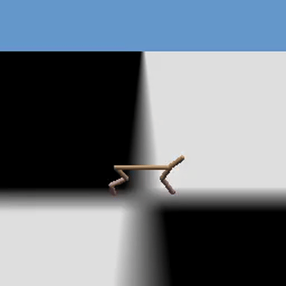
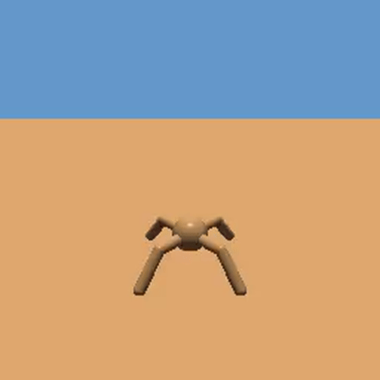
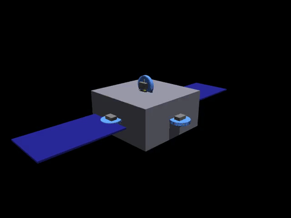
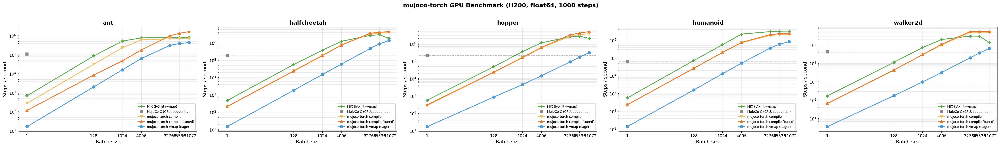

# mujoco-torch

A PyTorch port of [MuJoCo MJX](https://mujoco.readthedocs.io/en/stable/mjx.html),
bringing GPU-accelerated physics simulation to the PyTorch ecosystem with full
`torch.compile` and `torch.vmap` support.

## Features

- **Drop-in MJX replacement** -- same physics pipeline (forward dynamics,
  constraints, contacts, sensors) reimplemented in PyTorch.
- **`torch.vmap`** -- batch thousands of environments in a single call with
  automatic vectorisation.
- **`torch.compile`** -- fuse the entire step into optimised GPU kernels; no
  Python overhead at runtime.
- **Numerically equivalent to MJX** -- verified at float64 precision for every
  step (see `test/mjx_correctness_test.py`).

## Installation

```bash
pip install mujoco-torch
```

For development (editable install):

```bash
pip install -e .
```

### Requirements

- Python >= 3.10
- PyTorch (see [compatibility notes](#pytorch--tensordict-compatibility) below)
- MuJoCo >= 3.0
- tensordict — **must be built from source or use nightlies from 2026-03-16 or
  later** (the latest stable release will not work; see
  [compatibility notes](#pytorch--tensordict-compatibility) below)

### PyTorch & tensordict compatibility

mujoco-torch is tested against **PyTorch nightly** and **tensordict main**.
All modes -- eager, `torch.vmap`, and `torch.compile(fullgraph=True)` -- work
out of the box with these versions.

> **Important:** The latest stable release of tensordict does **not** include the
> `UnbatchedTensor` wrapper-subclass support that mujoco-torch requires.  You
> must either install from source or use a **nightly build dated 2026-03-16 or
> later**.

```bash
# PyTorch nightly (CUDA 13.0 example; adjust the index URL for your CUDA version)
pip install --pre torch --index-url https://download.pytorch.org/whl/nightly/cu130

# Option 1: tensordict from source
pip install git+https://github.com/pytorch/tensordict.git

# Option 2: tensordict nightly (>= 2026-03-16)
pip install --pre tensordict --index-url https://download.pytorch.org/whl/nightly/cpu
```

#### Monkey patches for upstream PyTorch PRs

Several upstream PyTorch fixes required by mujoco-torch have not yet landed in a
release.  Rather than requiring a custom PyTorch fork, mujoco-torch ships
**monkey patches** (in `mujoco_torch/patches/`) that are applied automatically
at import time.  Each patch is a no-op when the corresponding upstream fix is
already present, so they are safe to use unconditionally and will silently
deactivate as PyTorch merges the fixes.

The patches cover:

<!-- UPSTREAM_PR_TRACKER_START -->
- [ ] [#175526 — `while_loop` vmap batching rule](https://github.com/pytorch/pytorch/pull/175526) -- required for `torch.vmap` over the simulation loop
- [ ] [#175525 — vmap compatibility with non-tensor leaves](https://github.com/pytorch/pytorch/pull/175525) -- allows vmap to handle non-tensor outputs gracefully
- [ ] [#175852 — vmap extension points for custom container types](https://github.com/pytorch/pytorch/pull/175852) -- enables `UnbatchedTensor` to participate in vmap
- [ ] [#176977 — MetaConverter storage memo for wrapper subclasses](https://github.com/pytorch/pytorch/pull/176977) -- fixes a cross-device error under `torch.compile` for `_make_wrapper_subclass` tensors
<!-- UPSTREAM_PR_TRACKER_END -->

Once all of the above PRs are merged into PyTorch, the `mujoco_torch/patches/`
directory can be removed entirely.

> **Note:** If you prefer to use a custom PyTorch build that already includes
> these fixes (e.g. the
> [`vmoens/nomerg-sum-prs`](https://github.com/vmoens/pytorch/tree/vmoens/nomerg-sum-prs)
> branch), the patches will detect that the fixes are present and skip
> themselves automatically.

## Quick start

```python
import mujoco
import torch
import mujoco_torch

torch.set_default_dtype(torch.float64)

# Load a MuJoCo model
m_mj = mujoco.MjModel.from_xml_path("humanoid.xml")
mx = mujoco_torch.device_put(m_mj).to("cuda")

# Create initial data and move to GPU
d_mj = mujoco.MjData(m_mj)
dx = mujoco_torch.device_put(d_mj).to("cuda")

# Single step
dx = mujoco_torch.step(mx, dx)

# Batched simulation with vmap
batch_size = 4096
envs = [mujoco_torch.device_put(mujoco.MjData(m_mj)).to("cuda")
        for _ in range(batch_size)]
d_batch = torch.stack(envs)
vmap_step = torch.vmap(lambda d: mujoco_torch.step(mx, d))
d_batch = vmap_step(d_batch)

# Compiled + batched for maximum throughput
compiled_step = torch.compile(vmap_step, fullgraph=True)
d_batch = compiled_step(d_batch)
```

## Feature matrix

| Category | Supported | Not yet supported |
|----------|-----------|-------------------|
| **Integrators** | Euler, RK4, ImplicitFast | Implicit |
| **Solvers** | CG, Newton | PGS |
| **Geom types** | Plane, HField, Sphere, Capsule, Box, Mesh | Ellipsoid, Cylinder |
| **Contact dim** | 1 (frictionless), 3 (frictional), 4 (torsional), 6 (rolling) | — |
| **Friction cone** | Pyramidal, Elliptic | — |
| **Joint types** | Free, Ball, Slide, Hinge | *(all supported)* |
| **Equality constraints** | Connect, Weld, Joint | Tendon, Distance |
| **Actuator dynamics** | None, Integrator, Filter, FilterExact, Muscle | User |
| **Actuator gain** | Fixed, Affine, Muscle | User |
| **Actuator bias** | None, Affine, Muscle | User |
| **Sensors** | 30+ types (position, velocity, acceleration) | CamProjection, Touch, Contact, FrameLinVel/AngVel/LinAcc/AngAcc |
| **Collision pairs** | 12 functions covering all supported geom combinations | — |

## Known limitations

- **Ellipsoid / Cylinder geoms** — no collision functions for these geom types.
- **Tendon / Distance equality constraints** — not yet ported from MJX.
- **PGS solver** — only CG and Newton solvers are available.

## RL Environment Zoo

The `zoo/` directory contains TorchRL `EnvBase` environments backed by
mujoco-torch, trained with standard RL algorithms (SAC, PPO) to validate the
physics simulation.

**HalfCheetah — SAC**



**Ant — SAC**



**Satellite (small)**




```bash
# SAC
python examples/train_sac.py --env halfcheetah --num_envs 64 --total_steps 500000

# PPO
python examples/train_ppo.py --env halfcheetah --num_envs 64 --total_frames 500000

# With torch.compile for GPU
python examples/train_sac.py --env ant --compile --num_envs 8192 --device cuda
```

## Benchmarks



Measured on a single NVIDIA GPU, float64 precision, 1 000 simulation
steps per configuration.  Sequential baselines (MuJoCo C, mujoco-torch loop)
are measured at B=1 since they scale linearly.  All values are **steps/second**
(higher is better).

### Humanoid

| Configuration | B=1 | B=128 | B=1 024 | B=4 096 | B=32 768 | B=65 536 | B=131 072 |
|---|--:|--:|--:|--:|--:|--:|--:|
| MuJoCo C (CPU, sequential) | 62,331 | — | — | — | — | — | — |
| mujoco-torch vmap (eager) | 14 | 1,612 | 12,951 | 51,089 | 360,289 | 597,784 | 822,304 |
| mujoco-torch compile | 232 | 26,383 | 204,938 | 716,332 | 1,838,902 | 2,051,061 | 2,157,184 |
| **mujoco-torch compile (tuned)** | **232** | **26,560** | **202,922** | **750,288** | **2,054,194** | **2,333,178** | **2,490,457** |
| MJX (JAX jit+vmap) | 560 | 72,609 | 553,166 | 2,197,238 | 3,025,783 | 2,955,525 | 2,901,042 |

### Ant

| Configuration | B=1 | B=128 | B=1 024 | B=4 096 | B=32 768 | B=65 536 | B=131 072 |
|---|--:|--:|--:|--:|--:|--:|--:|
| MuJoCo C (CPU, sequential) | 108,133 | — | — | — | — | — | — |
| mujoco-torch vmap (eager) | 16 | 2,025 | 15,919 | 62,928 | 309,175 | 388,585 | 433,904 |
| mujoco-torch compile | 279 | 31,517 | 231,249 | 605,029 | 684,886 | 690,486 | 691,788 |
| **mujoco-torch compile (tuned)** | **117** | **8,561** | **47,573** | **178,229** | **981,050** | **1,341,747** | **1,638,131** |
| MJX (JAX jit+vmap) | 693 | 85,873 | 522,176 | 765,381 | 807,987 | 825,012 | 813,614 |

### Half-Cheetah

| Configuration | B=1 | B=128 | B=1 024 | B=4 096 | B=32 768 | B=65 536 | B=131 072 |
|---|--:|--:|--:|--:|--:|--:|--:|
| MuJoCo C (CPU, sequential) | 179,607 | — | — | — | — | — | — |
| mujoco-torch vmap (eager) | 15 | 1,863 | 14,974 | 59,903 | 469,505 | 886,691 | 1,366,018 |
| mujoco-torch compile | 215 | 24,480 | 191,728 | 765,819 | 3,343,947 | 3,724,683 | 3,970,075 |
| **mujoco-torch compile (tuned)** | **211** | **23,999** | **185,761** | **745,732** | **3,584,003** | **4,122,131** | **4,479,824** |
| MJX (JAX jit+vmap) | 470 | 57,302 | 376,552 | 1,235,532 | 2,693,183 | 2,968,019 | 1,800,632 |

### Walker2d

Walker2d uses the RK4 integrator, which makes each step ~3× more expensive
than Euler.

| Configuration | B=1 | B=128 | B=1 024 | B=4 096 | B=32 768 | B=65 536 | B=131 072 |
|---|--:|--:|--:|--:|--:|--:|--:|
| MuJoCo C (CPU, sequential) | 42,232 | — | — | — | — | — | — |
| mujoco-torch vmap (eager) | 4 | 177 | 975 | 3,192 | 20,291 | 37,710 | 64,563 |
| mujoco-torch compile | 64 | 4,348 | 29,570 | 101,431 | 490,919 | 463,347 | 471,967 |
| **mujoco-torch compile (tuned)** | **66** | **4,380** | **29,963** | **110,369** | **537,248** | **533,513** | **537,856** |
| MJX (JAX jit+vmap) | 169 | 11,565 | 72,567 | 200,463 | 308,394 | 302,793 | 136,074 |

### Hopper

Hopper uses the RK4 integrator (like Walker2d).

| Configuration | B=1 | B=128 | B=1 024 | B=4 096 | B=32 768 | B=65 536 | B=131 072 |
|---|--:|--:|--:|--:|--:|--:|--:|
| MuJoCo C (CPU, sequential) | 212,505 | — | — | — | — | — | — |
| mujoco-torch vmap (eager) | 18 | 867 | 4,482 | 14,408 | 90,066 | 166,800 | 304,215 |
| mujoco-torch compile | 285 | 22,652 | 153,702 | 572,233 | 2,652,525 | 3,327,314 | 3,710,821 |
| **mujoco-torch compile (tuned)** | **309** | **23,510** | **161,201** | **609,688** | **3,187,133** | **4,091,785** | **4,893,648** |
| MJX (JAX jit+vmap) | 575 | 47,496 | 350,215 | 1,117,554 | 2,487,794 | 2,699,727 | 1,997,695 |

**"tuned"** = Inductor coordinate-descent tile-size tuning + aggressive fusion
enabled (`torch._inductor.config.coordinate_descent_tuning`,
`aggressive_fusion`).  Adds ~40 min extra compile warmup but produces faster
kernels at runtime.

**Methodology.**  Each configuration runs 1 000 timed steps after 100 warmup
steps (the warmup triggers compile/JIT on the first call).  Wall-clock time is
measured with `torch.cuda.synchronize()` / `jax.block_until_ready()` bracketing.
Steps/s = `batch_size × nsteps / elapsed_time`.  Measured on a single NVIDIA
H200, dtype=float64.

To reproduce a single (env, mode, backend) run:

```bash
python examples/bench_all.py --env humanoid --mode compile --backend torch \
    --batch_sizes 1 128 1024 4096 32768 65536 131072 \
    --out bench_results.jsonl --tuned
```

Then aggregate and plot:

```bash
python examples/bench_all_to_plot.py bench_results*.jsonl -o results.json
python benchmarks/plot_bench.py results.json -o assets/benchmark.png
```

## Testing

```bash
# Run all tests (requires JAX + MJX for correctness tests)
pip install "jax[cpu]" "mujoco[mjx]"
pytest test/ -x -v
```

## License

Apache 2.0 -- see [LICENSE](LICENSE).

## Acknowledgments

mujoco-torch is a derivative work of
[MuJoCo MJX](https://github.com/google-deepmind/mujoco/tree/main/mjx),
originally developed by Google DeepMind.  See the [NOTICE](NOTICE) file for
attribution details.

The differentiable simulation features (smooth collision detection, Contacts
From Distance, and adaptive integration — available via
`mujoco_torch.differentiable_mode()`) are based on the work of Paulus, Geist,
Schumacher, Musil & Martius:

> **Hard Contacts with Soft Gradients: Refining Differentiable Simulators for
> Learning and Control.**
> Anselm Paulus, A. René Geist, Pierre Schumacher, Vít Musil, Georg Martius.
> [arXiv:2506.14186](https://arxiv.org/abs/2506.14186), 2025.
